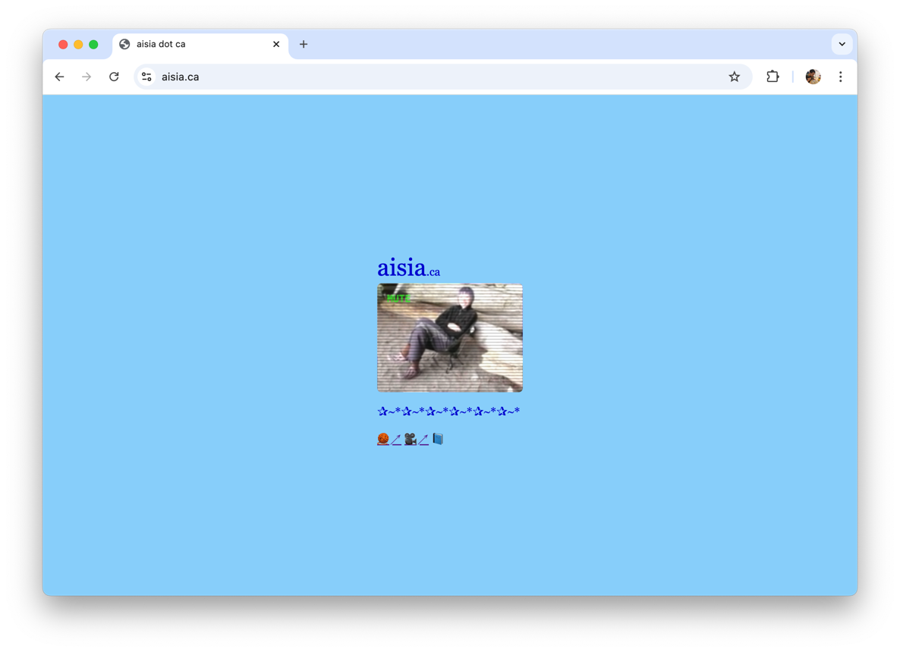

# `aisia.ca`

this is a handmade website, for my friend aisia

this website came about because aisia's username on letterboxd was `aisia.ca`, and i couldn't stop staring at it.
i'm not sure if it's because it's a palindrome, but to me it's a beatiful url. just look at it!

## todo

- [ ] replace the audio in each of the camping videos
- [ ] add "white noise" to channel changes
- [ ] add sawtooth/vhs noise to smpte channel
- [ ] add a toggleable description overlay with video names/dates

## song credits

| video                                      | song | artist |
| ------------------------------------------ | ---- | ------ |
| [L1070726.mp4](mp4/camping/L1070726.mp4)   |      |        |
| [L1070727.mp4](mp4/camping/L1070727.mp4)   |      |        |
| [L1070746.mp4](mp4/camping/L1070746.mp4)   |      |        |
| [L1070747.mp4](mp4/camping/L1070747.mp4)   |      |        |
| [L1070750.mp4](mp4/camping/L1070750.mp4)   |      |        |
| [L1070755.mp4](mp4/camping/L1070755.mp4)   |      |        |
| [L1070759.mp4](mp4/camping/L1070759.mp4)   |      |        |
| [L1070760.mp4](mp4/camping/L1070760.mp4)   |      |        |
| [L1070764.mp4](mp4/camping/L1070764.mp4)   |      |        |
| [L1070765.mp4](mp4/camping/L1070765.mp4)   |      |        |
| [L1070766.mp4](mp4/camping/L1070766.mp4)   |      |        |
| [L1070767.mp4](mp4/camping/L1070767.mp4)   |      |        |
| [L1070770.mp4](mp4/camping/L1070770.mp4)   |      |        |
| [L1070774.mp4](mp4/camping/L1070774.mp4)   |      |        |
| [L1070775.mp4](mp4/camping/L1070775.mp4)   |      |        |
| [L1070776.mp4](mp4/camping/L1070776.mp4)   |      |        |
| [L1070780.mp4](mp4/camping/L1070780.mp4)   |      |        |
| [L1070781.mp4](mp4/camping/L1070781.mp4)   |      |        |
| [L1070782.mp4](mp4/camping/L1070782.mp4)   |      |        |
| [L1070783.mp4](mp4/camping/L1070783.mp4)   |      |        |
| [L1070786.mp4](mp4/camping/L1070786.mp4)   |      |        |
| [L1070790.mp4](mp4/camping/L1070790.mp4)   |      |        |
| [L1070791.mp4](mp4/camping/L1070791.mp4)   |      |        |
| [L1070793.mp4](mp4/camping/L1070793.mp4)   |      |        |
| [L1070794.mp4](mp4/camping/L1070794.mp4)   |      |        |
| [L1070795.mp4](mp4/camping/L1070795.mp4)   |      |        |
| [L1070797.mp4](mp4/camping/L1070797.mp4)   |      |        |
| [L1070798.mp4](mp4/camping/L1070798.mp4)   |      |        |
| [L1070799.mp4](mp4/camping/L1070799.mp4)   |      |        |
| [L1070800.mp4](mp4/camping/L1070800.mp4)   |      |        |
| [lucycanontaro.mp4](mp4/lucycanontaro.mp4) | lucy | alex g |

## development scripts that i need to remember

- `for f in *.full.mp4 ; do ffmpeg -i "$f -s 192x144 ../mp4/"${f%.full.mp4}.mp4" ; done`
- `ffmpeg -i lucycanontaro.mp4 -vf "scale=192x144:force_original_aspect_ratio=decrease,pad=192x144:-1:-1:color=black" ../mp4/lucycanontaro.mp4`
